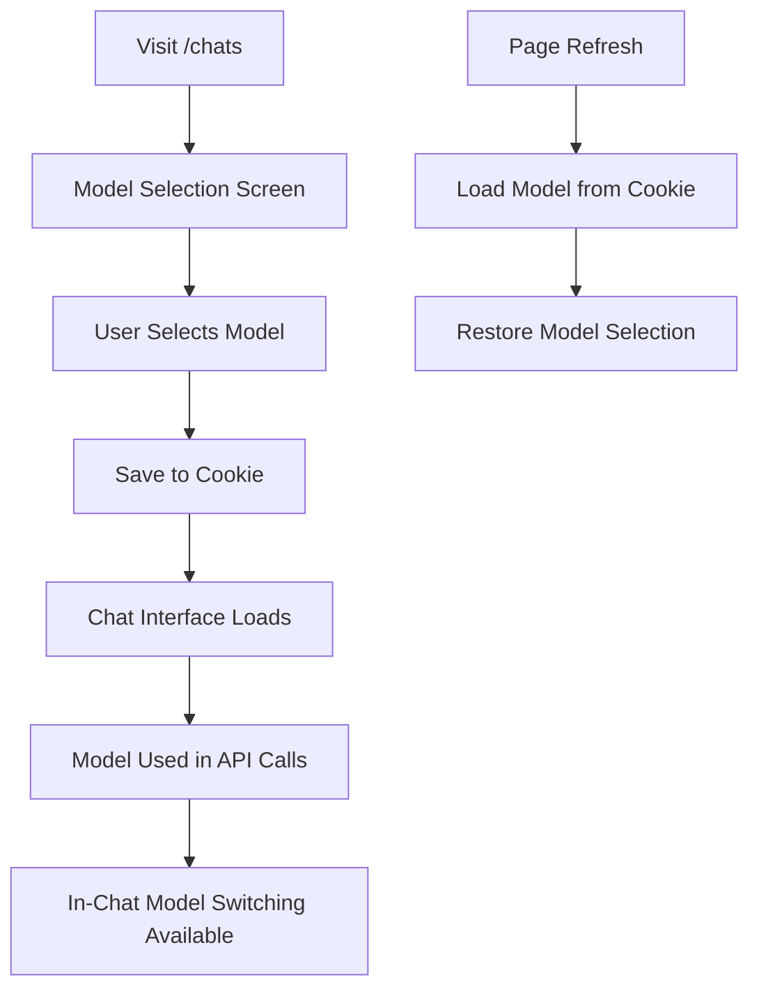

# Architecture

## Overview

Cloneathon-chat is a modern real-time chat application that integrates AI capabilities for enhanced conversation experiences. The application allows users to engage in conversations with AI models, manage documents, and collaborate in a multi-modal environment. Key features include:

- User authentication (NextAuth.js) and account management, including guest user functionality.
- Chats associated with projects, providing organizational context.
- Real-time chat with AI assistants, with model and system prompt persistence per chat.
- Document creation, editing, and management (foundational).
- Multi-modal interactions supporting text, and potentially images/code attachments.
- Suggestion system for content improvement (foundational).
- Chat history and conversation management.
- Public and private visibility settings for chats.
- Streamlined onboarding and user interface, with a focus on core chat functionality.

The application serves as a platform for interactive AI-assisted communication, document collaboration, and knowledge management in a chat-centric interface. It leverages modern web technologies to provide a responsive, accessible, and feature-rich user experience.

## Architecture

The application follows a modern, layered architecture based on Next.js App Router pattern combined with a client-server model. The architecture can be described as:

### Architectural Pattern

The application uses a **layered architecture** with clear separation of concerns:

1.  **Presentation Layer**: React components (client and server) and Next.js pages, styled with Tailwind CSS and Shadcn UI.
2.  **Application Layer**: Next.js API Route Handlers (e.g., for chat), Server Actions, and client-side logic (e.g., `useChat` hook).
3.  **Domain Layer**: Core business logic encapsulated in services/actions and data models/types.
4.  **Data Access Layer**: Database operations via Drizzle ORM, with queries defined in `lib/db/queries.ts`.
5.  **Infrastructure Layer**: External services (e.g., OpenAI via AI SDK) and authentication (NextAuth.js).

The application also incorporates aspects of:

- **Component-Based Architecture**: UI is built from reusable, composable React components.
- **API-Driven Design**: Backend functionality is exposed through API endpoints (e.g., `/api/chats`).
- **Feature-Based Organization**: Code is often organized by feature (e.g., `chats`, `projects`, `auth`).

### Key Architectural Decisions

1.  **Next.js App Router**: For modern routing, server components, client components, and API route handlers.
2.  **Server Actions & API Routes**: Server Actions for some mutations, and API Routes (like `/api/chats`) for core functionalities like chat streaming and history.
3.  **PostgreSQL with Drizzle ORM**: For type-safe database access and schema management (`lib/db/schema.ts`).
4.  **NextAuth.js**: For robust authentication, session management, and provider integration.
5.  **AI SDK Integration**: Direct and simplified integration for AI model interactions using the `ai` SDK (`streamText`, `CoreMessage`, `useChat` hook), primarily with OpenAI models.
6.  **Simplified Chat API**: The `POST /api/chats` route handles both new chat creation and streaming messages for existing chats, with streamlined persistence logic.
7.  **Middleware for Authorization**: `middleware.ts` handles route protection, guest user redirection, and authorization checks based on user email for specific admin/test routes.
8.  **Client-Side State Management**: Primarily React Context and component state, with `useChat` for managing chat interaction state.

## Components

The application is organized into several core components and modules:

### Frontend Components

1.  **Authentication Components** (`app/(auth)/*`, `components/auth/*`)

    - Login and signup pages.
    - UI elements for user sessions (e.g., user button).
    - Integration with NextAuth.js for client-side session management.

2.  **Chat Interface** (`components/chat/*`, `app/chats/[chatId]/page.tsx`, `app/chats/new/page.tsx`)

    - Core chat UI using `useChat` hook for message streaming and input handling.
    - Display of messages, including markdown rendering (`ChatMessage`).
    - Multi-modal input capabilities (`MultimodalInput`).
    - Chat list and item components (`ChatItem`, `ChatList`).
    - Persistence of `systemPrompt` and `model` per chat, configurable by the user.

3.  **Project Management** (`app/projects/*`, `components/project/*`)

    - Project creation dialog and page (`CreateProjectDialog`, `app/projects/new/page.tsx`) with guest user handling.
    - Listing and management of projects (foundational).
    - Chats are associated with projects at the data layer.

4.  **UI Components** (`components/ui/*`)

    - Reusable UI elements (buttons, cards, inputs, dialogs, etc.) from Shadcn UI.
    - Layout components and styling utilities (`Tailwind CSS`).
    - Responsive design elements.
    - Toast notifications via `sonner`.

5.  **Navigation and Structure** (`components/navigation/*`, `app/layout.tsx`)

    - Application sidebar (`AppSidebar`) for navigating chats and projects.
    - Header components (`HeaderIsland`).
    - Main application layout providing consistent structure.

6.  **Testing & Utility Pages** (`app/tests/*`)
    - Pages for testing specific functionalities, like displaying user chats by ID (`app/tests/ids/page.tsx`) with improved UI.

### Backend Modules

1.  **Authentication System** (`lib/auth/*`, `app/api/auth/[...nextauth]/route.ts`, `middleware.ts`)

    - NextAuth.js configuration for authentication providers.
    - Session management and token validation (`getToken`).
    - Middleware (`middleware.ts`) for route protection, enforcing authorization rules (e.g., `AUTHORIZED_EMAILS`), and handling guest user redirects.

2.  **Database Layer** (`lib/db/*`)

    - Drizzle ORM schema definitions (`schema.ts`) for tables like `users`, `chats`, `messages`, `projects`. Includes `systemPrompt`, `model`, `lastActivityAt` in `chatsTable`.
    - Database query functions (`queries.ts`) for CRUD operations and complex lookups.
    - Migrations managed by Drizzle Kit.

3.  **AI Integration & Chat API** (`lib/ai/*`, `app/api/chats/route.ts`)

    - Main chat API at `app/api/chats/route.ts`:
      - `POST` handler: Manages new chat creation (saves chat metadata and initial messages, returns `newChatId`) and streams AI responses for existing chats using `streamText` from the `ai` SDK with OpenAI.
      - `GET` handler: Retrieves chat history or resumes streams using `resumable-stream` context.
      - `DELETE` handler: Deletes chats.
    - Helper functions for formatting message parts for DB (`formatPartsForDB`) and deriving text content (`deriveTextContent`).
    - `DEFAULT_SYSTEM_PROMPT` and selected model are used for AI interactions.
    - AI tools (like `getWeatherInformation`) are defined but their integration into the main chat flow is basic.

4.  **Server Actions** (`app/chats/actions.ts`, `app/projects/actions.ts`, etc.)
    - Functions for server-side logic callable from client components, e.g., `saveChatModelAsCookie`, `getChatsForUser`.

## Workflow

### Authentication Flow

1.  User accesses the application.
2.  `middleware.ts` checks the route and authentication status:
    - Unauthenticated users are redirected from protected routes to `/login` or `/api/auth/guest`.
    - Authenticated users without specific authorization (e.g., not in `AUTHORIZED_EMAILS`) are redirected from admin/test routes.
    - Guest users attempting actions like project creation are prompted to log in.
3.  User authenticates via NextAuth.js (e.g., GitHub OAuth, credentials).
4.  Session is established, and user data (including type like 'guest') is available via `useSession` or `auth()`.

### Chat Interaction Flow

1.  User navigates to `/chats` to see their chat list or starts a new chat (e.g., `/chats/new`).
2.  For a new chat, initial parameters like `systemPrompt` and `model` can be set.
3.  User types a message in `MultimodalInput`.
4.  The `useChat` hook sends the message history (and other relevant data like `id` for existing chats, or `selectedChatModel`, `system` for new ones) to `POST /api/chats`.
5.  **If new chat**: API creates a `chats` record, saves initial messages, returns `newChatId`. The client then typically navigates to `/chats/[newChatId]`.
6.  **If existing chat**: API uses `streamText` with the AI model (OpenAI) and message history.
7.  AI response is streamed back to the client via `useChat` and displayed in `ChatMessage` components.
8.  The `onFinish` callback in `POST /api/chats` (or client-side logic post-stream) handles saving the assistant's message to the database and updating `lastActivityAt`.

### Project Creation Flow

1.  User navigates to `/projects/new` or uses `CreateProjectDialog`.
2.  User fills in project details.
3.  On submission, a request is made to `POST /api/projects`.
4.  API validates data, creates a project record in the database.
5.  Client is notified (e.g., toast) and redirected to the new project page or project list.
6.  Guest users are blocked and prompted to log in.

### Data Flow

1.  **Client (React Components) -> Server (API Routes / Server Actions)**:

    - User interactions trigger API calls (e.g., `fetch` in `useChat` to `/api/chats`) or Server Actions.
    - Data is sent as JSON payloads or form data.

2.  **Server (API / Actions) -> Database (Drizzle ORM)**:

    - API handlers and Server Actions use query functions from `lib/db/queries.ts`.
    - Drizzle ORM translates these calls into SQL queries for PostgreSQL.
    - Data is persisted or retrieved.

3.  **Server (API / Actions) -> AI Services (OpenAI via AI SDK)**:

    - `app/api/chats/route.ts` sends messages, system prompts, and model choices to OpenAI using `streamText`.
    - AI responses are streamed back to the server.

4.  **Server (API / Actions) -> Client (React Components)**:
    - API routes return JSON data or streams (e.g., AI chat responses).
    - Server Actions return results to client components.
    - Next.js handles SSR/RSC for initial page loads.

## Dependencies

### Core Framework & UI

- **Next.js**: Full-stack React framework (App Router).
- **React**: UI library.
- **TypeScript**: Type safety.
- **Tailwind CSS**: Utility-first CSS.
- **Shadcn UI / Radix UI**: Accessible component primitives.
- **Framer Motion**: Animations.
- **Lucide React / @iconify/react**: Icons.
- **Sonner**: Toast notifications.

### State Management & Data Fetching

- **React Context / `useState` / `useEffect`**: Client-side state.
- **AI SDK (`useChat`)**: Manages chat interaction state and data fetching for chat.
- **SWR / React Query**: (Potentially used for other data fetching needs, or direct `fetch`).

### Authentication

- **NextAuth.js**: Authentication and session management.

### Database & ORM

- **Postgres.js**: PostgreSQL client.
- **Drizzle ORM & Drizzle Kit**: Type-safe ORM and migrations.

### AI & Machine Learning

- **AI SDK (`ai`, `@ai-sdk/openai`, `@ai-sdk/react`)**: Core libraries for AI model interaction, streaming, and UI integration.
- **Resumable Stream (`resumable-stream`)**: For managing resumable streaming context in `GET /api/chats`.

### Utilities

- **Zod**: Schema validation.
- **date-fns**: Date manipulation.
- **uuid**: Unique ID generation.
- **clsx / `cn` utility**: Conditional class names.

### Development & Testing

- **Biome**: Linting, formatting.
- **Playwright**: End-to-end testing (setup present).

## Future Enhancements

The Cloneathon-chat application is continuously evolving. Key areas planned for future development and enhancement include:

1.  **Advanced AI Features**:

    - **Robust Tool Usage**: Fully integrate and expand AI tools beyond basic examples, with proper schema and execution logic.
    - **Fine-tuned Prompt Engineering**: Develop more sophisticated and context-aware prompt strategies.
    - **Enhanced Message Persistence**: Ensure all aspects of AI interaction (tool calls, rich content) are reliably saved.

2.  **Collaboration & Sharing**:

    - Implement real-time collaboration features for documents and chats.
    - Refine sharing mechanisms and permissions for projects and chats.

3.  **Multi-Modal Capabilities**:

    - Improve handling of image uploads and display within chats.
    - Explore support for other media types.

4.  **Scalability & Performance**:

    - Optimize database queries, especially for large datasets (many chats/messages).
    - Improve real-time communication efficiency.
    - Performance tuning for frontend rendering, especially for long chat histories.

5.  **Testing & CI/CD**:

    - Increase unit, integration, and E2E test coverage.
    - Mature CI/CD pipelines for automated builds, tests, and deployments.

6.  **User Experience Refinements**:
    - Continue to iterate on UI/UX based on user feedback.
    - Enhance onboarding and in-app guidance.

This document provides a snapshot of the current architecture and is subject to change as the project evolves.

---

